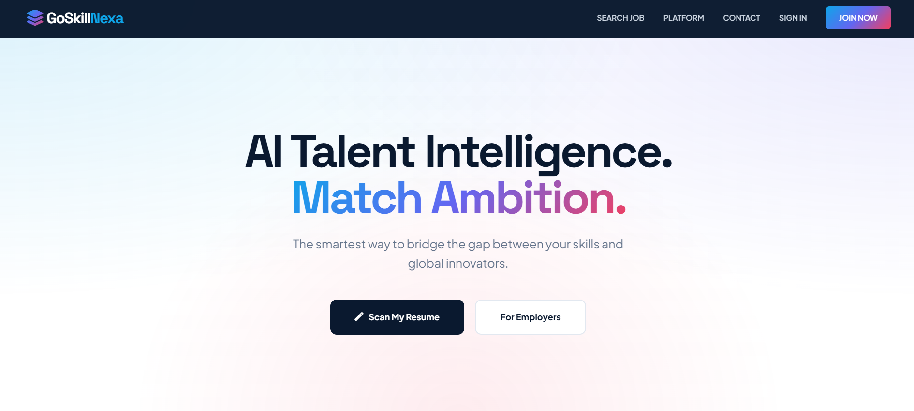
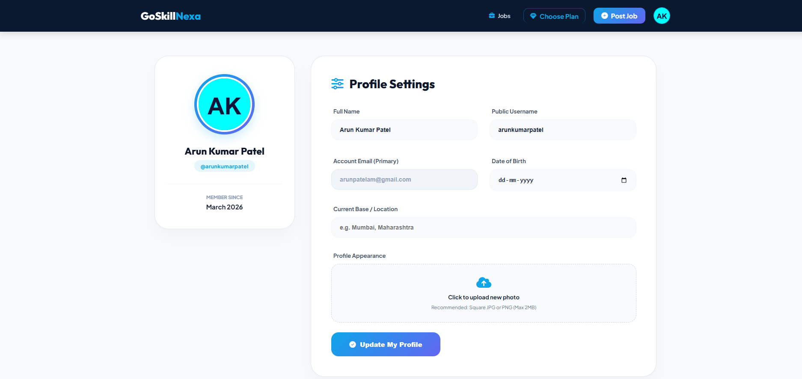

# AI Resume Analyzer and Job Matcher

AI-powered Resume Analyzer and Intelligent Job Matching System built using Flask, Python, NLP, Machine Learning, and MySQL.

## Features

- Resume Upload
- Resume Parsing
- Skill Extraction
- AI Job Matching
- Login & Signup System
- Job Recommendations
- Dashboard Analytics
- PDF Resume Analysis

## Technologies Used

- Python
- Flask
- HTML
- CSS
- JavaScript
- MySQL
- PyMuPDF
- NLP
- Machine Learning

## Installation

```bash
pip install -r requirements.txt
python app.py
```
## Home Page


## Login Page


## Dashboard Page

